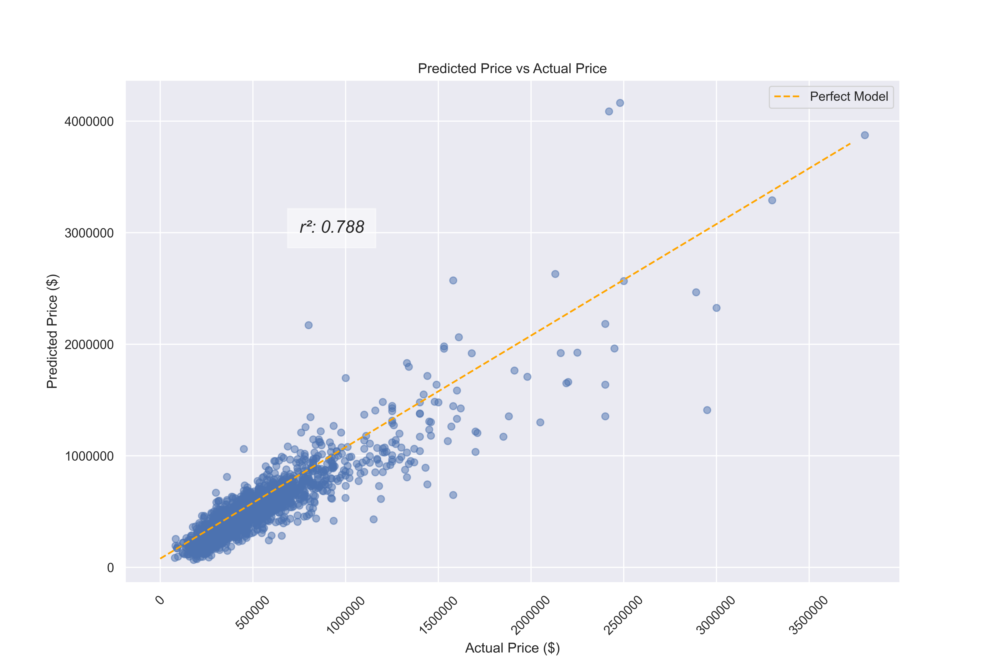

# Fogo de Chao New Location Analysis
Authors: John Sheehan, Yue Yu, Zach Pollatsek

## Overview
Fogo de Chao is a high-end restaurant chain that has found success all across the United States. High-end restaurants tend to perform better when located in neighborhoods/city areas that are in close proximity to higher priced neighborhoods. Fogo de Chao has one location in Bellevue, WA, and the restaurant group has seen tremendous success here. 

## Business Problem
Fogo de Chao has tasked us with finding the best possible location in the Seattle area for their second restaurant in the state of Washington. Specifically, Fogo de Chao wants to know which zip codes a new restaurant could be located in order to optimize success. The restaurant group wants to ensure that the new location will be in close proximity to those who are comfortable paying for a high-end dining experience. 

We will use housing data from King County government to determine answers to the following questions:

- In which neighborhood should Fogo de Chao open a new restaurant to optimize their chance as success?

- Does the location of a home influence the price of that home?

- Do the quality and size of a house influence its price?

## Data

[King County Government](https://www.kaggle.com/datasets/harlfoxem/housesalesprediction) has provided housing data from 2014-2015 that can be found on Kaggle. The data file analyzed herein provides home prices, location data, quality data, and house/lot size data. There is also data for the views at a given home as well as whether or not the home has been renovated and when. 

## Methods

This project uses multiple linear regression modeling to infer correlation between home price and all other characteristics within the data. We specifically used location data, house/lot size data, and quality of home data. 

## Results

Our final model captures approximately 80% of the variance within home price. From our model, we can see that it does relatively well at infering home price based on the given inputs of location, size, and quality of home. 

Of all zip codes, we found that 6 zip codes increased home price in our model. The Stevens/Madison Valley neighborhood (from this group of 6) has the highest average home price. 

## Conclusions

- **We recommend opening a new Fogo de Chao location in the Stevens/Madison Valley neighborhood (98112).** There are 3 neighborhoods that we believe could be ideal for Fogo de Chao to open a new location: East Queen Anne/South Lake Union (98109), Stevens/Madison Valley (98112), and West Queen Anne/North Queen Anne (98119).
- **Based on our model, if a home is in the 98112 zip code, the inferred home price increases by $107,000 with all else held constant.** 

## Next Steps

Opening a new restaurant can be a risky endeavor, so if we are given more time to help Fogo de Chao, we would like to perform additional analysis:

- Remove irrelevant zip codes that Fogo de Chao wouldn't enter due to space constraints, general disposition of neighborhood, etc. 
- Perform more feature engineering on relevant input variables to improve our correlation and reduce total error of our model.
- Remove latitude or longitude, as they are highly correlated to one another in a given city.

## For More Information

See the full analysis in the [Jupyter Notebook](KC_Housing_Final_Notebook.ipynb) or review [this presentation](FogodeChao_Seattle_Presentation.pdf).

For additional info, contact John Sheehan, Yue, Yu, or Zach Pollatsek as follows:

- John:   JohnJsheehan8@gmail.com 
- Yue:    yuyue772@gmail.com
- Zach:   zacharypollatsek@gmail.com

## Repository Contents
- data
- images
- Working Notebooks
- .gitignore
- README.md
- FogodeChao_Seattle_Presentation.pdf
- KC_Housing_Final_Notebook.ipynb
